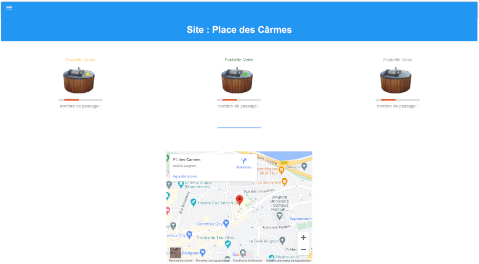
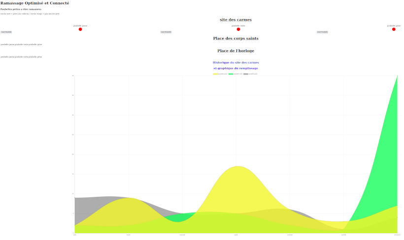

# Mini-projet ROC (Ramassage Optimisé et Connecté) 2022

Il s’agit de réaliser Le système ROC (Ramassage Optimisé et Connecté). Ce système, grâce aux conteneurs semi-enterrés permet une simplification de la collecte des déchets, plus de tournées de collecte systématique.

## Objectifs

Il s'agit de réaliser une application logicielle web afin d'interagir avec un système numérique réalisé conjointement par des étudiants IR et EC.

Les fonctionnalités demandées sont :

- communiquer via une liaison série avec un système embarqué réalisé par l'étudiant EC afin de :
    - récupérer des données en provenance du module électronique
    - envoyer des commandes et/ou paramètres de configuration au module électronique
- produire une IHM web afin :
    - d'afficher des données en provenance du module électronique
    - de commander et/ou paramétrer le module électronique
    - stocker des données et/ou des paramètres de configuration (base de données et/ou fichiers)

## Base de données

```sql
CREATE DATABASE roc1;

USE roc1;

CREATE TABLE recyclable (
    idPoubelle int(10) NOT NULL,
    pourcentage  float,
    nbrSac  int,
    latitude float,
    longitude float,
    IdSite int,
    PRIMARY KEY (idPoubelle)
);

CREATE TABLE vert (
    idPoubelle int(10) NOT NULL,
    pourcentage float,
    nbrSac int,
    latitude float,
    longitude float,
    IdSite int,
    PRIMARY KEY (idPoubelle)
);

CREATE TABLE gris (
    idPoubelle int(10) NOT NULL,
    pourcentage float,
    nbrSac int,
    latitude float,
    longitude float,
    IdSite int,
    PRIMARY KEY (idPoubelle)
);

INSERT INTO recyclable (idPoubelle, pourcentage, nbrSac, latitude, longitude, IdSite)
VALUES (1,0,0,0,0,1);

INSERT INTO vert (idPoubelle, pourcentage, nbrSac, latitude, longitude, IdSite)
VALUES (2,0,0,0,0,1);

INSERT INTO gris (idPoubelle, pourcentage, nbrSac, latitude, longitude, IdSite)
VALUES (3,0,0,0,0,1);
```

## Captures





## Auteur

- [Baptiste cochet](https://github.com/bcochet)
- [Salaun matthieu](https://github.com/m-salaun)
